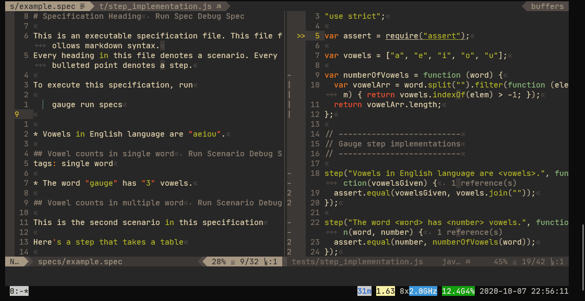

# coc-gauge

Gauge language server extension for [coc-nvim](https://github.com/neoclide/coc.nvim).

[Gauge](https://gauge.org/) is a light-weight cross-platform test automation tool.

**Notes:**
- This is not an official repository by Gauge project.  
- Some code blocks are taken from [coc-nvim](https://github.com/neoclide/coc.nvim) and [gauge-vscode](https://github.com/getgauge/gauge-vscode)
- Currently, I'm checking only JavaScript as step implementation language, but others may work.

## Motivation

The `gauge` command offers language server feature, so you can use it's featue with just setup coc config like below.

```json
{
  "languageserver": {
    "gauge": {
      "command": "gauge",
      "args": ["daemon", "--lsp", "--dir", "."],
      "filetypes": ["spec"],
      "rootPatterns": ["manifest.json"]
    }
  }
}
```

However, it lacks many features compared to guage-vscode.  
By using this extension, you can get the below features in neovim/vim!

- Running tests
- Debugging tests
- Renaming step (It works just using the LSP, but is insufficient)
- Listing locations that refer a step

## Install

`:CocInstall coc-gauge`

## Commands And Keymaps

| Command                            | \<Plug\>(keymap)                      | Description                         |
|------------------------------------|---------------------------------------|-------------------------------------|
| coc-gauge.runAll                   | coc-gauge-run-all                     | Run all specs                       |
| coc-gauge.runSpec                  | coc-gauge-run-spec                    | Run spec opened in current buffer   |
| coc-gauge.runScenarioUnderCursor   | coc-gauge-run-scenario-under-cursor   | Run scenario under the cursor       |
| coc-gauge.runRepeat                | coc-gauge-run-repeat                  | Run with last launched config       |
| coc-gauge.debugAll                 | coc-gauge-debug-all                   | Debug all specs                     |
| coc-gauge.debugSpec                | coc-gauge-debug-spec                  | Debug spec opened in current buffer |
| coc-gauge.debugScenarioUnderCursor | coc-gauge-debug-scenario-under-cursor | Debug scenario under the cursor     |
| coc-gauge.debugRepeat              | coc-gauge-debug-repeat                | Debug with last launched config     |
| coc-gauge.stop                     | coc-gauge-stop                        | Stop runnning gauge test            |
| coc-gauge.renameStep               | coc-gauge-rename-step                 | Rename step under the cursor (\*)    |
| coc-gauge.restartGaugeService      | coc-gauge-restart-service             | Restart Gauge language server       |


*: You can also rename a step by executing `CocAction('coc-rename')`, but it does
not work properly, because coc.nvim renaming command uses `<cword>` to get the
name, but step name is generally separated by space characters.

## Config

- coc-gauge.enable(default: true)  
  Enable this extention.
- coc-gauge.verbose(default: false)  
  Run gauge command with '--verbose' option.
- coc-gauge.coc-gauge.autoScrollOutputWindow(default: false)
  [Experimental] Automatically scroll the output window to the bottom.

## Debug

[vimspector](https://github.com/puremourning/vimspector) is required to be
installed for debugging.

Place the following json file as `<project-root>/.vimspector.json` for
debugging.

```json
{
  "configurations": {
    "run": {
      "adapter": "vscode-node",
      "configuration": {
        "request": "attach",
        "stopOnEntry": true,
        "protocol": "inspector",
        "console": "integratedTerminal"
      },
      "breakpoints": {
        "exception": {
          "all": "N",
          "caught": "",
          "uncaught": "Y"
        }
      }
    }
  }
}
```

The exception part is important! If you don't set the part, vimspector asks you
some questions before attaching the session. However, Gauge wait for just 1
second. Therefore, during the dialogue, Gauge gives up waiting for attaching
from debugging session, then resume running without any breakpoints.

## Autocommands

`filetype=spec` is set on event `BufEnter *.cpt`.

## Videos

Run


Debug


Jump step references


Rename step


## License

MIT

---

> This extension is created by [create-coc-extension](https://github.com/fannheyward/create-coc-extension)
